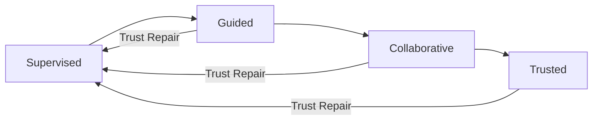

# Trust Building Over Time

## Trust Is Earned, Not Configured

### The Principle
Agent trust is built **incrementally through demonstrated competence**, not toggled on. Design for a **relationship that evolves**.

### The Trust Journey

**Stage 1: Supervised**: Agent asks permission before acting. Every decision presented for approval with full reasoning.

**Stage 2: Guided**: Routine decisions handled independently. Major decisions still require approval. Human reviews periodic summaries.

**Stage 3: Collaborative**: Established working rhythm. Agent knows when to act and when to ask. Human focuses on exceptions and strategy.

**Stage 4: Trusted**: Agent operates independently. Human receives outcome summaries. Intervention by exception only.

### Designing for Trust Transitions

Transitions should be:
- **Gradual**: Smooth expansion, not sudden switches
- **Evidence-based**: Triggered by track record, not time elapsed
- **Reversible**: Trust decreases if errors occur
- **Transparent**: Humans understand where they are and why

### Trust Repair

When trust breaks, support recovery through:
1. **Immediate transparency**: Full disclosure of what went wrong
2. **Impact assessment**: Consequences and remediation
3. **Root cause**: One-time error or systemic issue?
4. **Adjustment**: Changes to prevent recurrence
5. **Autonomy recalibration**: Temporarily reduced independence

### The Trust Paradox

More trust means less oversight, making errors harder to catch. Counter this with:
- **Automated monitoring** at all trust levels
- **Periodic audits** sampling agent decisions
- **Proactive reporting** on edge cases, even successfully handled ones
- **External validation** via cross-checking systems

### Organizational vs. Personal Trust

- **Personal**: Built through individual experience
- **Organizational**: Built through aggregate performance data

These can diverge. Design must accommodate both.

---

## Responsive Salience: Trust as a Dynamic System

> *Based on the levels of automation framework ([Parasuraman, Sheridan & Wickens, 2000](https://doi.org/10.1109/3468.844354)) and practical patterns from [Smashing Magazine](https://www.smashingmagazine.com/2026/02/designing-agentic-ai-practical-ux-patterns/)*

Rather than requiring users to manually toggle trust settings, **responsive salience** lets the system auto-adjust its visibility and interaction intensity based on real-time signals:

- **Task complexity and perceived risk** - Unfamiliar or high-stakes tasks increase agent visibility
- **User expertise and comfort level** - New users see more explanations and approval gates
- **Historical trust signals** - Track record of successful interactions reduces friction over time

When trust appears low, the system increases salience: richer explanations, additional approval gates, expanded transparency. When trust is high, the system works quietly and reports results.

When well-calibrated, users tend not to notice the system is adapting - it just feels natural. But preferences diverge sharply. Some users find high-salience modes exhausting, while others appreciate the guidance. The system must adapt to individual style, not just context.

This maps to the [Coordination Zones](/experience-design/coordination-zones): responsive salience dynamically shifts whether a given task is *done-with-me*, *done-for-me*, or *done-under-me*.

---

## Measuring Trust: Metrics That Matter

Concrete metrics for tracking trust health in your product:

| Metric | What It Measures | Target | Warning Signal |
|---|---|---|---|
| **Acceptance Ratio** | Plans accepted without edit / total plans shown | > 85% | Below 70% = agent misalignment |
| **Override Frequency** | "Handle it myself" clicks / total plans shown | < 10% | Above 15% = trust breakdown |
| **Setting Churn** | Autonomy setting changes / active users per month | Low & stable | High churn = trust volatility |
| **Trust Density** | % breakdown of users per autonomy level | Healthy bell curve | Clustering at lowest level = adoption failure |
| **Recovery Speed** | Time from trust-breaking event to pre-event autonomy level | Context-dependent | Never recovering = permanent damage |
| **"Why?" Ticket Volume** | Support tickets tagged "Agent Behavior - Unclear" per 1,000 users | Decreasing trend | Rising trend = explainability gap |

> **Design rule:** If override frequency exceeds 10%, don't blame the user - audit the agent's decision model.

*Sources: Victor Yocco, ["Designing For Agentic AI"](https://www.smashingmagazine.com/2026/02/designing-agentic-ai-practical-ux-patterns/) (Smashing Magazine, Feb 2026); Parasuraman, Sheridan & Wickens, ["A Model for Types and Levels of Human Interaction with Automation"](https://doi.org/10.1109/3468.844354) (IEEE, 2000)*
