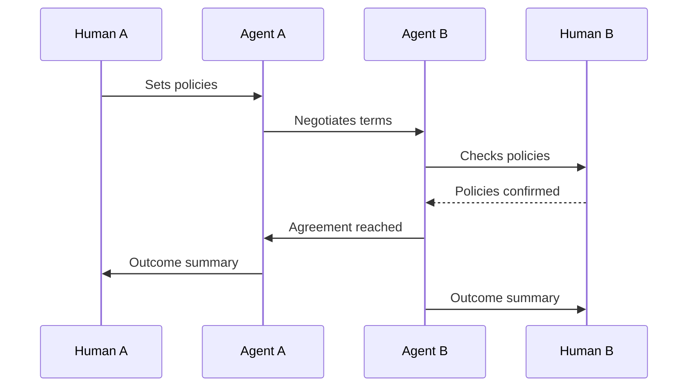

# Agent Identity & Dynamics

## Agents Need Identities

### The Emerging Question
As agents become autonomous and cross organizational boundaries, they need **trackable, verifiable, accountable identities**.

### Why Identity Matters

**Trust requires track record.** Organizations need performance history, regulators need accountability chains, and users need verification before delegating decisions.

### What Agent Identity Might Include

- **Performance history**: Accuracy, error rates, decision quality across deployments
- **Compliance certifications**: Verification against HIPAA, GDPR, Basel III, etc.
- **Behavioral profile**: Designed capabilities, known limitations, and biases
- **Lineage**: Training data, origin, contributors
- **Version history**: Changes between versions

### Agent Reputation Systems

Think **credit scores for agents**:
- Built through demonstrated performance
- Portable across organizations
- Domain-specific (high in claims processing ≠ high in marketing)
- Affects initial trust level defaults

### Design Implications

- **Agent profiles**: Capabilities, track record, certifications, and limitations
- **Verification badges**: Compliance status, performance tier, audit history
- **Comparison interfaces**: Side-by-side evaluation like products
- **Accountability mapping**: Who's responsible: creator, deployer, user, or agent?

### The Open Questions

- Who maintains agent identities: creator, third party, or regulator?
- Is reputation tied to agents or to the organizations deploying them?
- What happens to reputation when an agent is forked or customized?
- How do you prevent reputation gaming?

---

## When Agents Negotiate With Other Agents

### The Emerging Question
The bigger shift comes when **agents interact primarily with other agents**: negotiating and transacting at machine speed while humans set policies and review results.

### What This Looks Like

**Insurance + Healthcare**: Hospital billing agent submits claim, insurer's agent reviews and negotiates, settlement reached, humans see outcome.

**Banking + Commerce**: Procurement agent negotiates with supplier's sales agent, terms agreed, human approvers review the deal.

**Government + Citizens**: Citizen's agent applies across multiple programs simultaneously, each program agent evaluates eligibility, citizen gets a unified recommendation.

**Manufacturing + Supply Chain**: Factory agent monitors prices across suppliers, renegotiates contracts when conditions shift, within human-set parameters.

### The Speed Problem

Agent-to-agent negotiation takes milliseconds vs. days for humans. This creates:
- **Market-speed transactions**: Procurement cycles in seconds
- **Real-time arbitrage**: Continuous optimization across providers
- **Flash dynamics**: Cascading effects from rapid agent-to-agent interactions

### The Visibility Challenge

How do humans maintain control when thousands of transactions happen hourly, reasoning is too complex for real-time review, and small decisions create emergent outcomes?

### Design Implications

- **Transaction summaries**: Aggregate understanding over line-by-line logs
- **Pattern detection**: Flag unusual volumes, pricing, or counterparties
- **Policy interfaces**: Humans set **rules of engagement**: bounds, counterparties, negotiation limits
- **Dispute resolution**: Processes for when agent negotiation fails
- **Market visualization**: Show dynamics (supply, demand, trends), not individual transactions

### The Open Questions

- What protocols govern agent-to-agent communication? Key standards: [MCP](https://modelcontextprotocol.io) for tool/data access, [A2A](https://github.com/google/A2A) for agent-to-agent coordination
- How do you audit fairness in agent-to-agent negotiation?
- What happens to markets at speeds humans can't follow?
- How do you prevent collusion between competing agents?

---

## Further Reading

- Parasuraman, R., Sheridan, T.B., & Wickens, C.D. (2000). ["A Model for Types and Levels of Human Interaction with Automation."](https://doi.org/10.1109/3468.844354) *IEEE Transactions on Systems, Man, and Cybernetics.* Foundational framework for thinking about automation levels and human oversight.
- Victor Yocco, ["Designing For Agentic AI: Practical UX Patterns For Control, Consent, And Accountability"](https://www.smashingmagazine.com/2026/02/designing-agentic-ai-practical-ux-patterns/) (Smashing Magazine, Feb 2026). Practical design patterns for agent-managed experiences.

