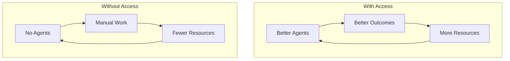

# Digital Divide 2.0

## The Next Inequality Frontier

### The Emerging Question
The first digital divide was about **internet access**. The next is about **agent access**: a **capability amplification inequality**.

### How the Divide Manifests

**Individual**: Agent users manage health, finances, and careers with AI support. Others do everything manually. The gap compounds over time.

**Organizational**: Agent-equipped companies operate faster and more adaptively. Others face structural disadvantage, driving consolidation.

**National**: Countries with agent infrastructure gain economic advantage, mirroring the industrial revolution's uneven impact.

### The Compounding Effect

The agent divide **compounds**: agent-empowered student → better education → better job → better agents → further ahead. Without access, each cycle widens the gap.

### Where Design Can Help

**Accessibility-first design**:
- Interfaces for all literacy levels, languages, and abilities
- Voice-first, low-bandwidth options
- Shared agents at libraries and community centers

**Public agent infrastructure**:
- Government-provided basic agents as public utilities
- Subsidized access for underserved communities
- Open-source agent templates

**Agent literacy programs**:
- Agent literacy in education from early age
- Workforce retraining including agent skills
- Community learning programs

**Inclusive design standards**:
- Design for the most constrained user
- Offline capabilities
- Multi-modal interfaces (voice, text, visual)

### The Equity Questions

- Is agent access a right or privilege?
- How do we prevent job elimination outpacing opportunity creation?
- Who bears the cost of universal agent access?
- How do affected communities shape agent development?

### The Stakes

These decisions determine whether agent-managed work **reduces inequality** or **amplifies it**. This must be addressed intentionally, not left to market forces.
