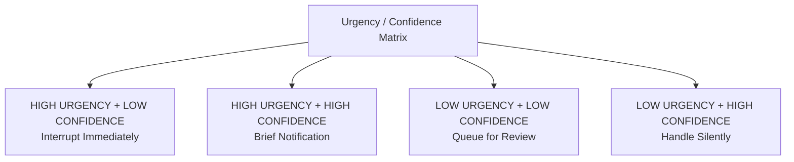

# Ambient Awareness

## From Active Monitoring to Peripheral Consciousness

Today's awareness is pull-based: you check apps, dashboards, notifications. Agent-managed awareness is **push-based but intelligently filtered**: information comes to you only when it matters.

## The Principle

Maintain **peripheral awareness** of agent activity: like a manager with an open office door. You trust things are fine. When something needs attention, it surfaces naturally.

## How This Manifests

### Intelligent Interruption
The system learns **when to interrupt** based on:
- **Urgency**: Time-sensitivity
- **Impact**: Consequence of delay
- **Novelty**: Never-before-seen situation
- **Confidence**: Agent's certainty in its recommendation
- **Context**: Are you in deep focus or between tasks?

Low urgency + high confidence = handled silently.
High urgency + low confidence = immediate interruption.

### Status Signals, Not Alerts
**Continuous signals** instead of binary notifications:
- Subtle color shifts: "everything's fine" vs. "needs attention soon"
- Gentle sound or haptic patterns conveying status without demanding attention
- Non-intrusive indicators: "busy," "idle," "waiting for input"

Like the hum of an office: you'd notice if it stopped.

### End-of-Cycle Summaries
**Natural summaries** at meaningful intervals, designed for reflection:
- End of day: what agents accomplished
- End of week: trends and patterns
- After milestones: summary and what's next

## Design Challenges

1. **Interruption calibration**: Too many and humans ignore them; too few and they lose trust. The sweet spot is personal and shifts over time.
2. **Transparency paradox**: People say they want full visibility but actually want only what matters.
3. **Modality matching**: Signals must work at a desk, on a phone, in a meeting, on a factory floor, in a car.
4. **Confidence through quiet**: Silence must feel reassuring, not worrying.
