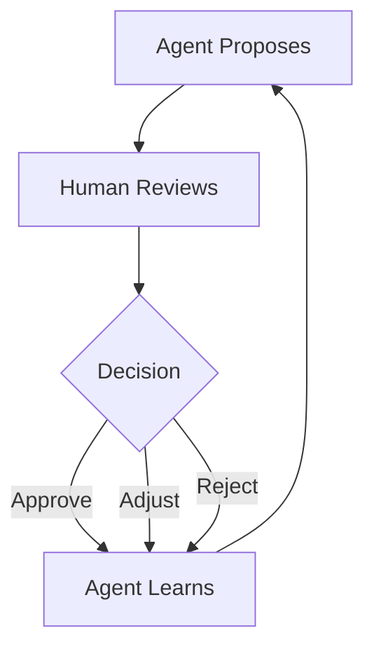

# The Approval Flow

## The Core UX Primitive

> **Agent proposes → Human reviews → Human approves, adjusts, or rejects**

The fundamental unit of agent-managed interaction.

## Why This Pattern Matters

The human's primary value-add is **judgment**:
- Agent does research, analysis, and preparation
- Human evaluates and decides
- Agent learns from decisions over time

Examples:
- Agent drafts customer complaint response → human reviews → approves or edits
- Agent recommends treatment adjustment → doctor reviews reasoning → approves or modifies
- Agent processes permit application → clerk reviews compliance → approves or flags

## Designing the Approval Flow

### The Proposal Card
A self-contained summary with enough context to decide:
- **What**: Proposed action
- **Why**: Agent's reasoning and how it got there
- **Risk**: What could go wrong and at what probability
- **Alternatives**: Other options considered
- **Urgency**: Time-sensitivity
- **Actions**: Approve / Adjust / Reject / Defer / Delegate

### Graduated Detail
- **Quick approvals**: Low-risk, streamlined card
- **Standard approvals**: Full proposal card
- **Deep reviews**: Full analysis with data, comparisons, and implications

### Batch Processing
- **Batch approval**: "These 15 items match past approvals: approve all?"
- **Category rules**: "For items like this, proceed without asking"
- **Smart grouping**: Similar decisions clustered for efficient review

### Learning Loop
- Approvals reinforce approach
- Rejections with explanation adjust behavior
- Adjustments show the agent how to improve
- Over time, fewer decisions need human review

## The Trust Spectrum

Movement along the trust spectrum is **earned, not configured**. See [Trust Building Over Time](/design-principles/trust-building) for the full trust progression model.

---

## The Intent Preview: Anatomy of a Good Proposal

> *Based on Victor Yocco, ["Designing For Agentic AI"](https://www.smashingmagazine.com/2026/02/designing-agentic-ai-practical-ux-patterns/) (Smashing Magazine, Feb 2026)*

The Intent Preview is the moment the agent says: "Here's what I'm about to do. Are you okay with that?" It transforms a black box into a transparent, reviewable plan.

### What Makes an Effective Intent Preview

- **Clarity and conciseness** - Plain language, no jargon. "Cancel flight AA123 to San Francisco" not "Executing API call to cancel_booking(id: 4A7B)"
- **Sequential steps** - For multi-step operations, outline key phases so users can spot issues in the proposed sequence
- **Clear user actions** - Three distinct paths: Proceed with Plan, Edit Plan, Handle It Myself

### Example: Travel Disruption Recovery

> **Proposed Plan for Your Trip Disruption**
>
> I've detected that your 10:05 AM flight has been canceled. Here's what I plan to do:
>
> 1. **Cancel Flight UA456** - Process refund and confirm cancellation details
> 2. **Rebook on Flight DL789** - 2:30 PM non-stop, next available confirmed seat
> 3. **Update Hotel Reservation** - Notify the Marriott of late arrival
> 4. **Email Updated Itinerary** - Send new details to you and your assistant
>
> *\[ Proceed with this Plan \] \[ Edit Plan \] \[ Handle it Myself \]*

This works because it provides a complete picture from cancellation to communication and offers three distinct control paths.

### Per-Task Autonomy Settings

Rather than a global autonomy level, effective products let users calibrate per task type:

| Task Type | Autonomy Setting | Example |
|---|---|---|
| Schedule meetings | Act with Confirmation | "I found 3 slots that work - confirm which one?" |
| Send emails on my behalf | Plan and Propose | "Here's the draft - review before I send" |
| Expense reports under $50 | Act Autonomously | Agent files and notifies after the fact |
| Budget reallocation | Observe and Suggest | "I noticed an opportunity - here's my analysis" |

This granularity reflects the reality of a user's trust: they may fully trust an agent with calendar management while wanting full control over external communications.
