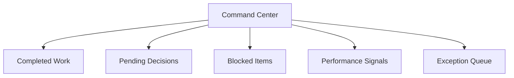

# The Command Center Pattern

## Your Workday Starts Differently

Instead of opening a to-do list or inbox, you open a **command center**: a single surface showing the state of your agent team.

## What It Shows

### Agent Status Overview
- **Completed work**: "12 claims processed. 3 inquiries resolved. 1 report generated."
- **Pending decisions**: "2 items need your judgment."
- **Blocked items**: "1 agent stuck: situation outside its guidelines."
- **Performance signals**: "Claim processing time improved 15% this week."

### Outcomes, Not Processes
Show **outcomes, not activities**. Not "Agent processed row 4,532 of 12,000" but "Portfolio rebalancing complete. Estimated savings: $45K."

### Exception Queue
The most critical element: things agents couldn't handle alone, requiring human involvement:
- **Judgment**: Ambiguous situations needing human interpretation
- **Authority**: Actions exceeding agent scope
- **Ethics**: Moral dimensions requiring human values
- **Novelty**: Never-before-seen situations
- **Confidence**: Agent uncertain about the right course
- **Conflict**: Competing priorities the agent can't resolve

## Design Principles

1. **Morning briefing model**: Design for the first 10 minutes of the workday
2. **Progressive disclosure**: Summary first, details on demand
3. **Actionable over informational**: Every item has a clear next action
4. **Temporal awareness**: Past, present, and upcoming across a time axis
5. **Comparative context**: "This is unusual" vs. "This is expected"

## What This Replaces

One surface replaces the **fragmented multi-app experience** (email, Slack, CRM, analytics, project tracker). The apps still exist underneath, but agents interact with them, not you.

> The command center is the home base. For how individual items flow through it, see [Approval Flow](/experience-design/approval-flow). For how the agent calibrates what to surface, see [Ambient Awareness](/experience-design/ambient-awareness). For the underlying coordination model, see [Coordination Zones](/experience-design/coordination-zones).
