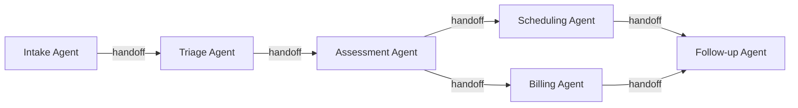

# Multi-Agent Choreography

## When Agents Work Together

Real work involves **teams of specialized agents** collaborating across workflows. The human needs to see the **choreography**: handoffs, bottlenecks, and conflicts.

## The Choreography View

### Flow Visualization
See the **flow between agents**, not each agent individually:
- Which agent handles the current phase?
- Where did the last handoff happen?
- What information was passed?
- Where is work stuck?

Think **orchestra conductor's score**: the whole composition, not individual parts.

### Handoff Points
**Handoffs** are the most critical moments: where information is lost, approaches conflict, delays accumulate, and human oversight is most valuable.

The choreography view treats handoffs as **first-class objects**: reviewable, auditable, adjustable.

### Conflict Resolution
When agents have competing priorities, surface:
- What each agent optimizes for
- Where objectives conflict
- Trade-offs and resolution options

Example: Scheduling agent wants the earliest slot; workload agent wants to balance the doctor's day. Human sees the tension and decides.

## Team Composition

Manage agent teams like human teams:
- **Hiring**: Selecting agents for a workflow
- **Roles**: Defining responsibility and scope
- **Communication**: How agents share information
- **Performance**: Evaluating team effectiveness

### The Agent Org Chart
- Front-line agents: direct execution
- Supervisory agents: coordinating front-line work
- Strategic agents: analysis and planning
- Humans: direction-setting and judgment

Human org design: at machine speed.

## Design Principles

1. **Show the whole, zoom into parts**: Default is the full workflow; details on demand
2. **Highlight the unusual**: Normal flow is visually quiet; anomalies stand out
3. **Enable recomposition**: Swap, add, or rearrange agents without starting over
4. **Time as a dimension**: "This handoff usually takes 2 min. Today: 20. Here's why."

---

## The Protocol Layer: MCP and A2A

> *As of 2026, multi-agent choreography has a standardized foundation.*

Two protocols now underpin how agents connect and collaborate:

**[MCP (Model Context Protocol)](https://modelcontextprotocol.io/)** standardizes how each agent accesses its tools and data. When your Billing Agent needs to read invoice data or your Assessment Agent needs to query a medical record system, MCP provides the universal connector. This matters for choreography because it means agents can be swapped without rewiring integrations.

**[A2A (Agent-to-Agent Protocol)](https://github.com/google/A2A)** standardizes how agents discover and communicate with each other. Each agent publishes an **Agent Card** describing its capabilities, and other agents can discover, negotiate with, and delegate to it - even across organizational boundaries.

### Design Implications for Choreography

- **Agent Cards as UI**: Show users what each agent in the workflow can do, where it came from, and what data it accesses
- **Cross-vendor workflows**: Agents from different providers can collaborate in a single workflow - the choreography view must show provenance
- **Portable agent teams**: Users can recompose teams by swapping in any MCP/A2A-compatible agent - like replacing a team member with a specialist
- **Cross-boundary audit trails**: When a workflow spans agents from 3 vendors using 2 protocols, the choreography view must provide a unified audit trail

The protocol landscape is evolving rapidly. [Model Context Protocol (MCP)](https://modelcontextprotocol.io) handles tool and data access. [Agent2Agent (A2A)](https://github.com/google/A2A) handles agent-to-agent communication.
