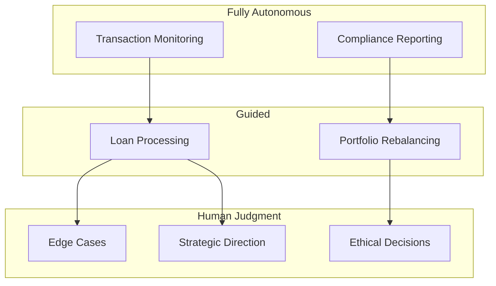

# Banking & Finance

## From Transaction Processors to Financial Governors

### The Current State
Banking runs on structured, rule-heavy, repetitive process: loan applications, compliance reviews, portfolio recommendations: even when stakes are high.

### The Agent-Managed Future

**What agents handle**:
- Real-time transaction monitoring and anomaly detection
- Loan processing: document verification, risk scoring, compliance checks
- Portfolio rebalancing based on market conditions and client goals
- Continuous regulatory reporting and compliance documentation
- Routine client communication and account notifications

**What humans handle**:
- Setting risk appetite and strategic direction
- Reviewing agent-flagged anomalies and edge cases
- Complex client relationships requiring trust and judgment
- Ethical decisions: borderline lending, bias auditing, fairness assessments
- Regulatory interpretation when rules are ambiguous

### A Day in the Life

Your agents processed 47 loan applications overnight: 42 approved, 3 declined, 2 flagged for your judgment. One involves a first-time business owner with unusual income patterns. The agent presents its analysis, comparable approvals, and risk assessment. You approve with adjusted terms. Your compliance agent monitors all transactions in real-time and surfaces a morning briefing of flagged patterns. You spend your day on relationships and judgment calls, not paperwork.

### Key Design Considerations

- **Auditability**: Every agent decision must be traceable and explainable for regulators
- **Bias monitoring**: Lending and risk decisions need continuous fairness monitoring
- **The invisible bank**: As agents interact via APIs, banks compete on **agent-friendliness**, not UI
- **Trust calibration**: High-consequence decisions require gradual, evidence-based trust-building
- **Cross-border complexity**: Agents must adapt to different jurisdictional regulations automatically
