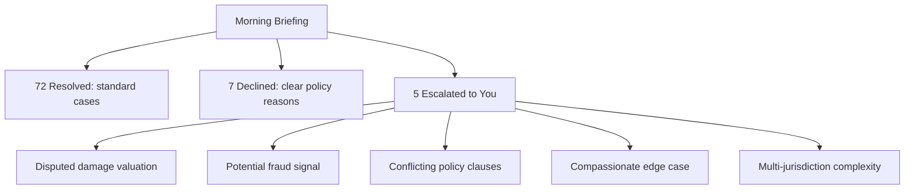

# A Day With Agents

Concrete walkthroughs of what a workday looks like in an agent-managed world: across different roles.

## The Insurance Claims Manager

### Morning Briefing
You open your command center. Overnight, your agent team processed 84 claims.

**What you see:** A summary card showing totals, trends vs. last week, and your 5 items. Not 84 individual claims.

**What you do:** Tap into each escalated item. The agent presents its analysis, the relevant policy sections, comparable past decisions, and its recommended action. You approve 2, adjust 1, reject 1, and request more information on 1.

**Time spent:** 45 minutes of judgment work. Zero paperwork.

### Midday
Your fraud detection agent flags a pattern across 3 seemingly unrelated claims. It doesn't have enough confidence to act, so it presents:
- The pattern it detected
- The evidence (with confidence levels)
- Two possible explanations (fraud vs. coincidence)
- Its recommendation: investigate further

You decide to investigate. You assign a specialized investigation agent and set parameters: "Look into the connection between these claimants. Check for shared addresses, phone numbers, or repair shops. Report back by end of day."

### Afternoon
Performance review of your agent team:
- Claims processing accuracy: 98.7% (up from 97.2% last month)
- Average resolution time: 4.2 hours (down from 6.1)
- Customer satisfaction on agent-resolved claims: 4.3/5
- One agent is underperforming on commercial vehicle claims: you review its recent decisions and provide corrective feedback

## The Hospital Department Head

### Morning Briefing

**What you see:**
- 42 patients currently admitted. Agent care teams have updated all charts overnight with vitals, lab results, and medication tracking.
- 3 patients flagged: one deteriorating trend, one possible drug interaction, one approaching discharge readiness
- Today's schedule: pre-populated with priority patients first, routine follow-ups grouped efficiently

**What you do:**
- Review the deteriorating patient's data. The agent presents a 48-hour vitals trend with its analysis. You agree with its recommendation to adjust medication and approve the change.
- The drug interaction flag: the agent caught a conflict between a new prescription and an existing supplement. You confirm the substitution it proposed.
- The discharge candidate: agent has prepared discharge paperwork, follow-up schedule, and patient education materials. You review and sign off.

**Then you do what matters:** Rounds. You spend time with patients: listening, examining, connecting. Your agent captures documentation from the encounter in real-time. You never touch a keyboard.

## The Government Services Director

### Morning Briefing

**What you see:**
- 340 permit applications processed overnight. 312 approved, 18 declined (with automated explanations sent to applicants), 10 escalated.
- Inter-agency coordination: your housing agent flagged 3 applicants who are also eligible for energy assistance: it's drafted cross-referrals for your approval.
- Citizen feedback: sentiment analysis shows satisfaction up, but two recurring complaints about unclear denial reasons.

**What you do:**
- Review the 10 escalated permits: each involves unusual zoning situations. The agent shows relevant precedents and its recommended interpretation.
- Approve the cross-referrals: citizens who didn't know they were eligible for additional benefits will now receive them proactively.
- Address the denial clarity issue: you teach your agent a better explanation template by showing it what a good denial letter looks like. "Use this tone. Include these specific references. Offer these next steps."

## What's Different About All Three

| Aspect | Today | With Agents |
|---|---|---|
| **First hour** | Wading through email, catching up on what happened | Briefing: clear picture in minutes |
| **Core activity** | Processing, documenting, administering | Judging, deciding, connecting |
| **Information** | You hunt for it across systems | It's assembled and presented to you |
| **Routine work** | Consumes 60–80% of your day | Handled entirely by agents |
| **Your unique value** | Hard to exercise because of admin burden | The primary focus of your day |
