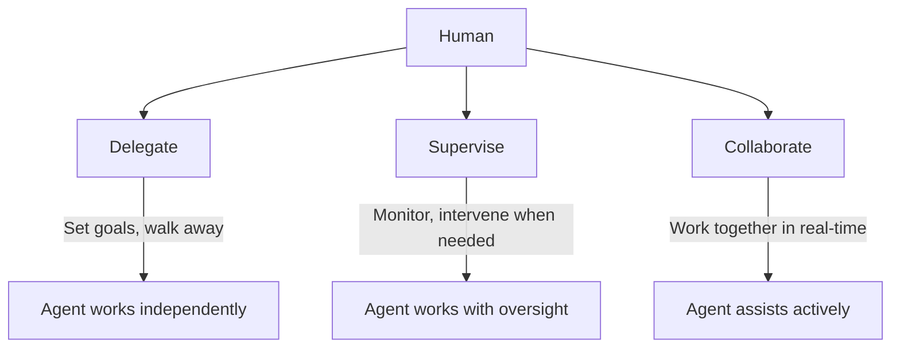
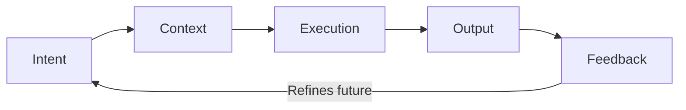

# The Agent Interaction Model

How humans actually interact with agents: the mechanics of the relationship.

## Three Interaction Modes

Humans interact with agents through three distinct modes, often switching fluidly between them.

### 1. Delegate
You set the goal and walk away. The agent works independently and reports back.
- "Process all new applications using our standard criteria"
- "Monitor the portfolio and flag anything outside our risk tolerance"
- Best for: routine, well-defined, low-risk work

### 2. Supervise
The agent works, you watch and step in when needed. Like a manager reviewing a junior employee's output.
- Agent drafts; you approve before it ships
- Agent recommends; you decide
- Best for: important work where the agent is still earning trust

### 3. Collaborate
You and the agent work together in real-time. Neither is fully in charge: it's a back-and-forth.
- Brainstorming strategy together
- Co-creating content where the agent drafts and you shape
- Debugging a complex problem where the agent surfaces data and you connect the dots
- Best for: creative, strategic, or complex work

## The Interaction Anatomy

Every agent interaction follows a consistent structure, regardless of mode:

| Stage | What happens | Human role | Agent role |
|---|---|---|---|
| **Intent** | The goal is established | Express what you want | Clarify ambiguity |
| **Context** | Relevant information is gathered | Provide domain knowledge | Pull data from systems |
| **Execution** | The work is performed | Monitor or step away | Do the work |
| **Output** | Results are delivered | Review and judge | Present clearly with reasoning |
| **Feedback** | Quality is assessed | Correct, approve, or redirect | Learn and adapt |

## How This Differs From Today's Software

| Aspect | Traditional Software | Agent Interaction |
|---|---|---|
| **Who adapts** | Human learns the software | Agent learns the human |
| **Failure mode** | Error messages, dead ends | Agent explains what went wrong and suggests alternatives |
| **Memory** | Stateless: every session starts fresh | Persistent: the agent remembers your preferences, history, and patterns |
| **Skill ceiling** | Power users who know shortcuts | Humans who express intent clearly and give good feedback |
| **Relationship** | Transactional: tool does what you click | Relational: agent builds understanding over time |

## The New Skill: Effective Delegation

The differentiating skill isn't technical ability: it's **delegation quality**:

- **Clear intent**: Specific about the outcome, flexible about the approach
- **Right mode**: Knowing when to delegate, supervise, or collaborate
- **Good feedback**: Explaining *why* something is wrong, not just that it is
- **Appropriate trust**: Neither over-trusting (blind delegation) nor under-trusting (micromanaging every action)
