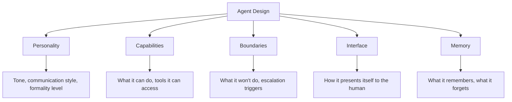
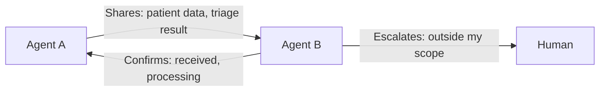

# Designing the Agent Itself

Agents are products with their own design requirements, not just backend logic. How should an agent be designed as an entity?

## Agent Anatomy

Every agent has these design surfaces, each requiring deliberate decisions:



## Personality Design

Agents need a designed personality. The goal is **consistency and appropriateness**, not human mimicry.

| Dimension | Design Decision | Example |
|---|---|---|
| **Tone** | Formal ↔ Casual | A banking agent is measured; a marketing agent is energetic |
| **Verbosity** | Concise ↔ Detailed | A busy executive wants bullet points; a researcher wants depth |
| **Confidence** | Assertive ↔ Cautious | A diagnostic agent should express uncertainty; a scheduling agent can be decisive |
| **Initiative** | Proactive ↔ Reactive | Should the agent suggest actions or wait to be asked? |
| **Transparency** | Explains everything ↔ Just delivers results | Depends on trust level and domain risk |

These aren't cosmetic choices. They directly affect whether users **trust, adopt, and effectively work with** the agent.

## Capability Boundaries

The most critical design decision: **what the agent will and won't do**.

```mermaid
flowchart LR
    subgraph Autonomous
        A1[Routine processing]
        A2[Data gathering]
        A3[Status updates]
    end
    subgraph Guided
        B1[Recommendations]
        B2[Draft communications]
        B3[Anomaly response]
    end
    subgraph Human Only
        C1[Ethical decisions]
        C2[Novel situations]
        C3[High-stakes commitments]
    end
    Autonomous -->|"Agent handles"| Guided
    Guided -->|"Agent proposes, human approves"| Human Only
    Human Only -->|"Human decides"| OUT[Action Taken]
```

Clear boundaries prevent:
- Agents overstepping into decisions they shouldn't make
- Users assuming the agent can handle things it can't
- Liability ambiguity when something goes wrong

## Memory Design

What an agent remembers shapes the relationship:

| Memory Type | What It Stores | Design Consideration |
|---|---|---|
| **Working memory** | Current task context | Expires when the task is done |
| **Preference memory** | User's style, habits, communication preferences | Persists and evolves over time |
| **Domain memory** | Learned workflows, organizational processes, institutional knowledge | Shared across the organization |
| **Interaction history** | Past decisions, feedback, corrections | Enables the agent to improve and maintain continuity |

Key design questions:
- What should the agent forget? (Privacy, relevance decay)
- Who can access an agent's memory? (The user, the team, the organization?)
- How does the agent surface its memory? ("I'm basing this on your feedback from last month: still relevant?")

## Interface Design: How the Agent Presents Itself

The agent's "face" is how it communicates with the human. This includes:

### Status Communication
The agent should always make its state clear:
- **Working**: "Processing 47 applications: estimated completion in 20 minutes"
- **Waiting**: "I need your input on the risk threshold before I proceed"
- **Stuck**: "I encountered a situation I haven't seen before. Here's what I know."
- **Done**: "Complete. Here's the summary. 3 items need your review."

### Confidence Signaling
Agents must communicate certainty levels honestly:
- "I'm confident this is the right approach" (high confidence, routine situation)
- "This is my best recommendation, but there's meaningful uncertainty" (moderate)
- "I don't have enough information to recommend. Here are the options." (low)

### Progressive Disclosure
The agent shows the right level of detail for the moment:
- **Glance**: One-line status: "12 claims processed, 2 need you"
- **Summary**: Key outcomes with reasoning: enough to approve or reject
- **Deep dive**: Full analysis, data, process log: for audit or learning

## Agent-to-Agent Design

When agents work together, each needs a designed **interface to other agents**:

- **What it shares**: What data and context it passes to the next agent
- **What it expects**: What input it needs from the previous agent
- **How it handshakes**: Confirmation that the handoff was successful
- **How it escalates**: What happens when the receiving agent can't handle what it received



## The Design Checklist

When designing an agent, answer:

1. **Who is this agent for?**: Which role, which workflow, which context?
2. **What is its scope?**: What it handles autonomously, what it proposes, what it never touches
3. **What's its personality?**: Tone, verbosity, initiative level, confidence expression
4. **What does it remember?**: And what should it forget?
5. **How does it present itself?**: Status, confidence, progressive detail
6. **How does it learn?**: From corrections, approvals, rejections, explicit teaching
7. **How does it fail?**: Gracefully, transparently, with clear escalation
8. **How does it work with other agents?**: Data sharing, handoffs, conflict resolution

> For how these design decisions play out in practice, see [The Command Center Pattern](/experience-design/command-center) for status presentation, [Ambient Awareness](/experience-design/ambient-awareness) for confidence signaling in context, and [Trust Building](/design-principles/trust-building) for how trust shapes what the agent shows over time.
