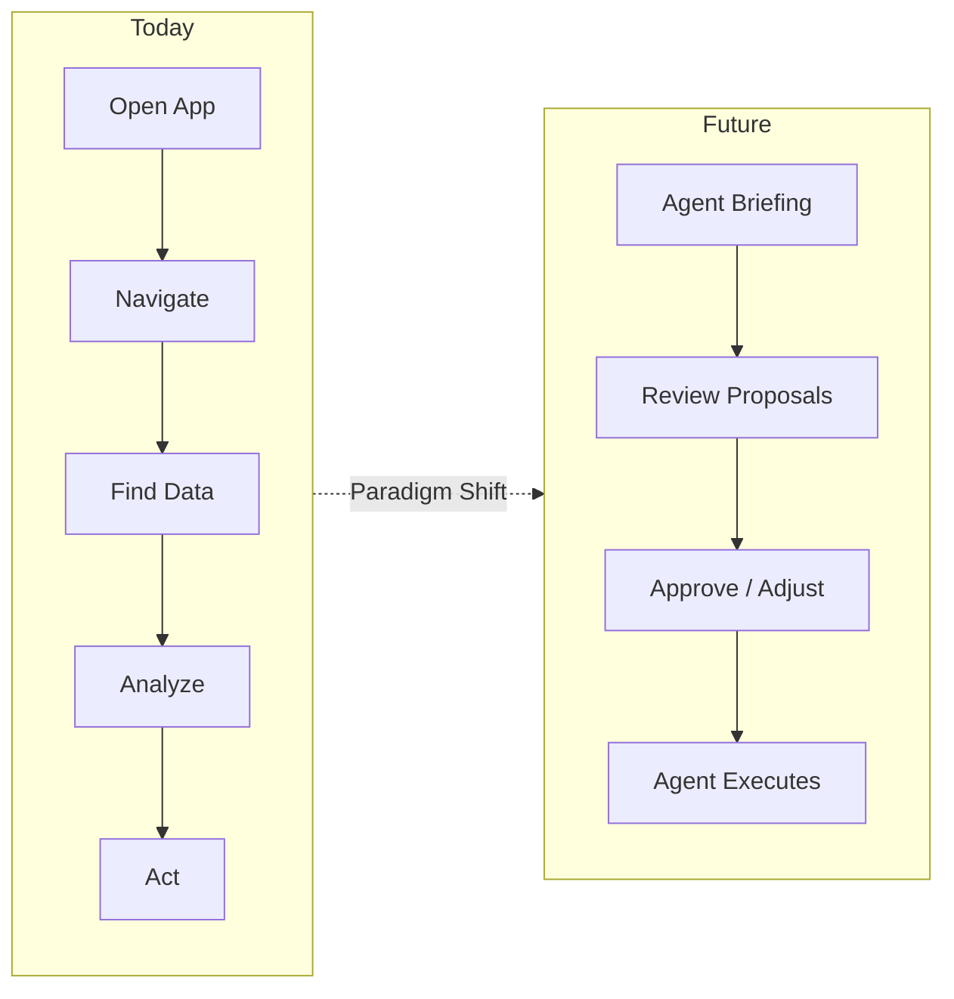

# Today vs. Future

Side-by-side comparison of how digital experiences work today versus how they'll work in an agent-managed world.

## The Interface Shift

| Dimension | Today | Agent-Managed Future |
|---|---|---|
| **Starting point** | Open an app, navigate to what you need | Agent briefs you on what matters |
| **Input model** | Click, type, select from menus | Express intent in natural language |
| **Information flow** | You pull: searching, filtering, browsing | Agents push: surfacing what's relevant |
| **Decision-making** | You gather data, analyze, then act | Agent gathers and analyzes, you judge and approve |
| **Multi-tool workflow** | Switch between 5–10 apps constantly | One surface, agents interact with tools underneath |
| **Error handling** | You troubleshoot and retry | Agent handles retries, escalates what it can't solve |
| **Personalization** | Toggle settings and preferences | Agent learns from your behavior and feedback |
| **Collaboration** | You coordinate with people via messages and meetings | Your agents coordinate with other people's agents |

## What Disappears

These interface patterns become obsolete or marginal:

- **Navigation menus**: You don't browse; agents bring what you need
- **Search bars**: You don't search; you ask or agents anticipate
- **Forms and data entry**: Agents populate from context; you confirm
- **Notification overload**: Agents filter; only what needs you reaches you
- **Dashboards you check**: Replaced by briefings that come to you
- **Settings panels**: Replaced by conversational behavior sculpting

## What Emerges

New interaction primitives that don't exist today:

- **The briefing**: A curated summary of what happened, what needs you, and what's coming
- **The proposal card**: An agent's recommended action with reasoning, for your approval
- **The exception queue**: Only the things agents couldn't handle, prioritized by urgency
- **The trust dial**: Visible, adjustable autonomy level for each agent
- **The choreography map**: Real-time view of how your agents are working together
- **The teaching moment**: Correcting agent behavior through natural feedback

## The Fundamental Difference

Today's products are **tools you operate**.
Future products are **teams you manage**.

The screen goes from being your workspace to being your **window into your agents' workspace**.
